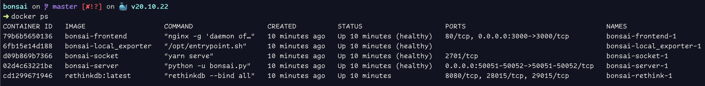

     
    
    <h1>Bonsai</h1>
    <h3>🌳 Minimal Monitoring System</h3>

## Setup
This project can be deployed on any machine running docker using docker-compose:
`docker-compose build`
`docker-compose up -d`

## Usage
Once the project has been deployed, its status can be checked using `docker ps`

The frontend is accessible under port 3000

### Frontend Views
#### Home
Gives an overview of all active exporters

#### Node Graph
Gives a visual overview of all active exporters

#### Dashboard
Interactive & Customizable dashboarding

#### Explore
Provides the raw output from each exporter

## Deploying Exporters
Additional exporters can be deployed either by running main.py (which is contained within bonsai_exporter_base) or by deploying an exporter container.

## Further Reading
See [INTRODUCTION.md](INTRODUCTION.md)