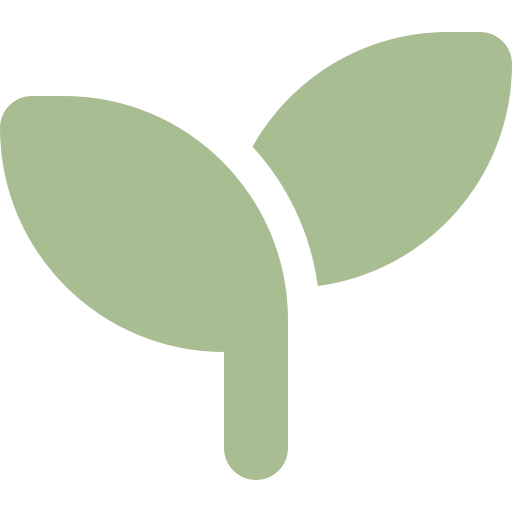

<div align="center">
    <br />
    
    <h1>Bonsai</h1>
    <h3>🌳 Minimal Monitoring System</h3>
</div>

<div align="center">

[](https://github.com/konstfish/bonsai/actions/workflows/publish.yml)
[](https://github.com/konstfish/score4you/blob/master/LICENSE)

</div>

This project was created in part of the fulfillment of my degree in [Computing](https://www.uclan.ac.uk/undergraduate/courses/computing-bsc-hons) at the [University of Central Lancashire](https://www.uclan.ac.uk/). See the complete project report [here](https://s.konst.fish/DavidFischer_ProjectReport2023.pdf).

## Build
`docker-compose build`
## Deploy
### Docker
`docker-compose up -d` or `docker-compose --file docker-compose.pub.yml up -d` for the pre-built images
See [Example Docker Compose](#example-docker-compose)

### Kubernetes
`kubectl apply -f kubernetes/bonsai.yml` (WIP)
Creates a `bonsai` namespace, an exporter DaemonSet & deployments/services for the system components
### Frontend Views
#### Home
Overview of all active exporters


#### Node Graph
Visual overview of all active exporters


#### Dashboard
Interactive & Customizable dashboarding


#### Explore
Provides the raw output from each exporter


## Example Docker Compose
```yaml
version: '3.9'
services:
  rethink:
    image: rethinkdb:latest
    volumes:
      - rethink_data:/data
    restart: always

  server:
    image: ghcr.io/konstfish/bonsai_server
    depends_on:
      - "rethink"
    links:
      - "rethink"
    environment:
      - IN_DOCKER_CONTAINER=1
    ports:
      - 50051:50051
      - 50052:50052
    restart: always

  local_exporter:
    image: ghcr.io/konstfish/bonsai_exporter_base
    depends_on:
      - "server"
    links:
      - "server"
    restart: always

  socket:
    image: ghcr.io/konstfish/bonsai_socket
    depends_on:
      - "server"
      - "rethink"
    links:
      - "rethink"
    environment:
      - IN_DOCKER_CONTAINER=1
    restart: always

  frontend:
    image: ghcr.io/konstfish/bonsai_frontend
    depends_on:
      - "socket"
    ports:
      - 3000:3000
    links:
      - "socket"
    restart: always

volumes:
  rethink_data:
```

## Further Reading
See [INTRODUCTION.md](INTRODUCTION.md)